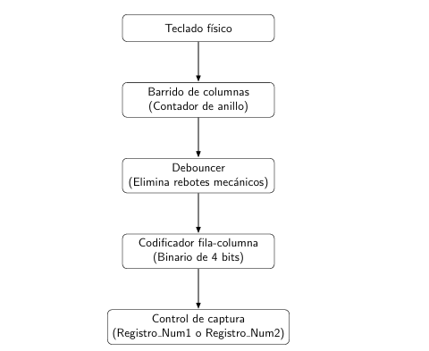
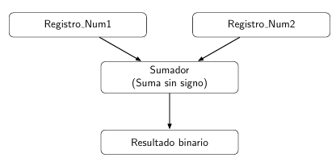
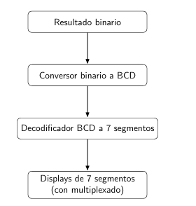
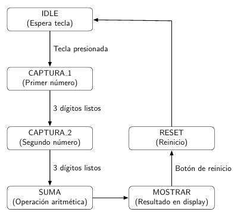
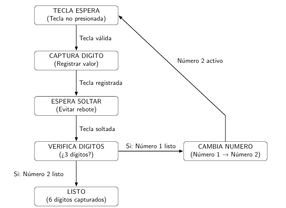

# **Proyecto 2 - Diseño Lógico (EL-3307)**
# **SISTEMA DE CAPTURA Y SUMA CON TECLADO HEXADECIMAL**

## **1. Introducción**

Este proyecto se basa en el diseño, desarrollo y validación de un sistema digital sincrónico utilizando SystemVerilog, cuyo propósito es capturar, procesar y mostrar la suma de dos números decimales ingresados a través de un teclado hexadecimal mecánico. La arquitectura del sistema fue estructurada de manera completamente modular, facilitando la comprensión, depuración y escalabilidad del mismo.

El sistema se implementa de forma sincrónica bajo un único reloj de 27 MHz, ideal para su despliegue en plataformas FPGA como la Tang Nano 9K. El usuario puede ingresar dos números decimales de hasta tres dígitos cada uno. Tras la captura secuencial de los datos, el sistema realiza su suma binaria sin signo, y luego despliega el resultado de forma dinámica en cuatro displays de 7 segmentos mediante multiplexación.

Todo el flujo de funcionamiento ha sido modelado en SystemVerilog y validado exhaustivamente mediante simulaciones funcionales con herramientas como Icarus Verilog y GTKWave, asegurando la correcta transición entre estados, la confiabilidad de los datos ingresados y la claridad del resultado mostrado.


## **2. Definición del problema y objetivos**

El problema propuesto surge a partir de la necesidad de diseñar una solución digital confiable y eficiente que permita al usuario ingresar dos números decimales utilizando un teclado hexadecimal tipo matriz (4x4). El desafío principal radica en gestionar la entrada de datos mecánicos, los cuales pueden estar sujetos a ruido (rebote), y en procesar correctamente la información capturada en un entorno sincrónico controlado por un único reloj.

Al finalizar este sistema debe ser capaz de:
- Eliminar rebotes mecánicos mediante un mecanismo de debounce digital.
- Capturar secuencialmente los dígitos de cada número, diferenciando entre el primer y segundo número mediante lógica de control.
- Realizar una suma aritmética binaria sin signo entre los dos números ingresados.
- Convertir el resultado binario en formato BCD para permitir su visualización amigable.
- Multiplexar la salida a cuatro displays de 7 segmentos de forma clara y sin parpadeo.
- Sincronizar correctamente todos los bloques funcionales bajo una sola fuente de reloj (27 MHz).

### **Objetivos específicos:**
- Diseñar FSMs robustas para la captura ordenada de dígitos y el control global del sistema.
- Modularizar cada subsistema para facilitar simulaciones, pruebas unitarias e implementación física.
- Usar lógica combinacional eficiente para minimizar el uso de recursos en FPGA.
- Garantizar una interfaz amigable entre el teclado y el usuario mediante respuesta visual directa (displays).
- Verificar todo el comportamiento funcional con testbenches exhaustivos en GTKWave.

Como se observa, este proyecto no solo busca una solución funcional, sino también una implementación didáctica y profesional que pueda ser reproducida y mejorada en entornos académicos, con la finalidad de dar solución al problema planteado.

## **3. Descripción general del funcionamiento del sistema**

El sistema completo se estructura en tres bloques funcionales principales, que trabajan de forma coordinada y sincronizada para cumplir con la tarea de captura, procesamiento y despliegue del resultado de una suma aritmética. Cada bloque está encapsulado en un subsistema independiente que interactúa con los demás a través de señales de control y datos.

### **a. Subsistema de captura de datos**
Este módulo se encarga de recibir las entradas del teclado hexadecimal tipo matriz 4x4. Está compuesto por los siguientes elementos: 

- Un **debouncer** que elimina posibles rebotes mecánicos al presionar las teclas.  
- Un **codificador de fila y columna**, que traduce la posición física presionada del teclado en un valor binario de 4 bits (hexadecimal).
- Una **FSM de captura** (`fsm_captura`) que organiza la secuencia de ingreso y define cuándo capturar el valor, si pertenece al primer número (`num1`) o al segundo (`num2`).
- Un **contador** que verifica cuántos dígitos han sido ingresados (3 por número).
- Dos **registros de almacenamiento**, cada uno de 12 bits, que guardan tres dígitos en formato BCD (4 bits por dígito).

### **b. Subsistema de suma aritmética**
Cuando se han capturado ambos números, este bloque realiza la suma binaria sin signo.

### **c. Subsistema de despliegue en displays**
Muestra el resultado final de la suma en cuatro dígitos a través de los siguientes componentes:
- **Conversión binaria a BCD** Utiliza el algoritmo “double dabble” para convertir el número binario de 13 bits a 4 dígitos BCD.
- **Decodificador BCD a 7 segmentos** Convierte cada dígito BCD a la salida correspondiente en segmentos a–g.
- **Multiplexado de displays** Activa cada uno de los 4 dígitos de forma cíclica usando un contador.
Este subsistema garantiza una visualización continua, estable y sin parpadeos visibles.

## 4. Diagramas de bloques y funcionamiento

A continuación se describen los principales bloques funcionales del sistema, junto con los diagramas que ilustran el flujo de datos y control entre módulos. Cada uno de estos diagramas representa un subsistema clave en el procesamiento, desde la lectura hasta la visualización del resultado.

---


### Figura 1. Diagrama de bloques del subsistema de lectura del teclado hexadecimal

Este diagrama representa la primera etapa del sistema, encargada de capturar los datos desde el teclado físico. El proceso de lectura inicia con un barrido de columnas usando un contador de anillo (ring counter), el cual activa cada columna una por una. Las filas detectan si alguna tecla ha sido presionada, generando una señal que pasa por un módulo debouncer, encargado de eliminar rebotes mecánicos. Una vez estabilizada, la señal entra a un codificador que convierte la posición fila/columna en un valor hexadecimal de 4 bits. Finalmente, una unidad de control determina si el valor debe almacenarse en el registro `Num1` o `Num2`, según la etapa de captura en la que se encuentre el sistema.

---


### Figura 2. Diagrama de bloques del subsistema de suma aritmética

Este diagrama muestra cómo se conectan los registros de entrada `Num1` y `Num2` con un sumador binario. Cada registro contiene 12 bits (3 dígitos decimales en BCD). El sumador opera de forma combinacional, sin requerir un reloj, y genera una salida de 13 bits que representa el resultado de la suma en binario sin signo. Esta operación es sencilla, pero crucial, pues establece la transición del sistema desde la captura hacia la visualización del resultado.

---


### Figura 3. Diagrama de bloques del subsistema de despliegue en displays de 7 segmentos

Aquí se ilustra cómo se procesa el resultado binario para hacerlo legible al usuario. Primero, el número binario pasa por un conversor binario a BCD (`bin_to_bcd`), que separa el valor en unidades, decenas, centenas y millares. Luego, cada dígito BCD es transformado en su patrón de encendido correspondiente por medio del módulo `decoder_bcd_7seg`. Finalmente, un multiplexor de displays activa secuencialmente cada uno de los cuatro dígitos a una frecuencia que el ojo humano percibe como una imagen continua. Esto permite mostrar números de hasta cuatro cifras en solo cuatro displays físicos compartiendo las mismas líneas de segmentos.

---


### Figura 4. Diagrama de estados de la FSM de control del sistema

Este diagrama representa la máquina de estados finita (FSM) global que gobierna la operación del sistema completo. Comienza en el estado `IDLE`, donde espera una pulsación de tecla. Luego transita por `CAPTURA 1` y `CAPTURA 2`, capturando los tres dígitos de cada número. Una vez que ambos están completos, pasa a `SUMA`, realiza la operación aritmética, y muestra el resultado en `MOSTRAR`. Finalmente, puede entrar en `RESET` para reiniciar el ciclo. Esta FSM es clave para sincronizar los tres subsistemas y garantizar que cada acción ocurra en el momento correcto.

---


### Figura 5. Diagrama de estados de la FSM del módulo de lectura del teclado

Este diagrama detalla la FSM local del módulo de lectura de teclado. Inicia en `ESPERA_TECLA`, esperando una pulsación válida. Al detectar una tecla, avanza a `CAPTURA_DIGITO`, donde almacena el valor. Luego pasa a `ESPERA_SOLTAR` para evitar rebotes, y sigue a `VERIFICA_DIGITOS` para contar cuántos dígitos se han ingresado. Si ya se capturaron 3 dígitos, pasa a `CAMBIA_NUMERO` (cambia de Num1 a Num2). Al capturar 6 dígitos (3 por número), entra en `LISTO`. Esta FSM asegura la captura ordenada y sin errores de cada dígito introducido.

## 5. Diagramas de estado de las FSM diseñadas

Para garantizar un control preciso y ordenado del sistema, se diseñaron dos máquinas de estados finitas (FSMs): una para el control general del sistema, y otra local para el proceso de captura de dígitos desde el teclado hexadecimal. Ambas FSMs fueron desarrolladas en SystemVerilog con lógica sincrónica y están documentadas gráficamente en los diagramas adjuntos.

---

### Figura 4. FSM de control general del sistema


Esta FSM es responsable de dirigir el flujo completo del sistema, desde que el usuario comienza la entrada de datos hasta que se muestra el resultado. Los estados definidos son:

- **IDLE:** Estado inicial. El sistema espera que se presione una tecla.
- **CAPTURA_1:** Se capturan los tres dígitos que forman el primer número.
- **CAPTURA_2:** Se capturan los tres dígitos del segundo número.
- **SUMA:** Realiza la suma binaria de los dos números almacenados.
- **MOSTRAR:** Muestra el resultado en los cuatro displays de 7 segmentos.
- **RESET:** Estado que permite volver a la condición inicial ante una nueva operación.

**Transiciones clave:**
- De `IDLE` a `CAPTURA_1`: se detecta una tecla presionada.
- De `CAPTURA_1` a `CAPTURA_2`: tres dígitos completados y `num1_activo` desactivado.
- De `CAPTURA_2` a `SUMA`: se completa el segundo número.
- De `SUMA` a `MOSTRAR`: la suma se calcula inmediatamente.
- De `MOSTRAR` a `RESET`: tras presionar el botón de reinicio o tras un retardo.

Esta FSM asegura que los subsistemas trabajen de forma sincronizada, sin interferencias entre captura, procesamiento y visualización.

---

### Figura 5. FSM del módulo de lectura del teclado


Esta FSM local pertenece al módulo de lectura de teclado. Su función es controlar el proceso de captura de un dígito individual, eliminando rebotes y garantizando que cada pulsación se registre una sola vez. Los estados son:

- **ESPERA_TECLA:** Espera que se presione una tecla válida (sin rebotes).
- **CAPTURA_DIGITO:** Se registra el dígito detectado.
- **ESPERA_SOLTAR:** Espera que la tecla sea soltada completamente.
- **VERIFICA_DIGITOS:** Verifica si ya se ingresaron 3 dígitos. Si es así:
  - Si el primer número está completo, pasa a `CAMBIA_NUMERO`.
  - Si ambos números están completos, transita a `LISTO`.
- **CAMBIA_NUMERO:** Cambia la bandera interna para comenzar a capturar el segundo número.
- **LISTO:** Señal de finalización del proceso de captura.

**Lógica de transición:**
- El módulo utiliza entradas como `tecla_valida`, `tecla_soltada`, y `num1_completo` para moverse entre estados.
- Genera las señales de salida `capturar`, `num1_activo` y `listo`.

Esta FSM fue diseñada para trabajar en conjunto con el debouncer y el codificador fila/columna, formando una interfaz robusta entre el usuario y el sistema digital.

## 6. Ejemplo y análisis de simulación funcional

Para validar el comportamiento del sistema antes de su implementación en FPGA, se desarrolló un testbench en SystemVerilog (`tb_top.sv`). Este simula el ingreso de dos números de tres dígitos cada uno a través de un teclado hexadecimal. El objetivo de la simulación es verificar:

- Que los datos se capturen correctamente desde el teclado.
- Que la suma se realice con precisión.
- Que el resultado se despliegue sin errores en los displays de 7 segmentos.

---

### Secuencia simulada

En la simulación se ingresaron los números **123** y **456**. Esto se logró mediante llamadas a la tarea `simulate_keypress`, que activa una fila del teclado durante un tiempo determinado y luego la libera. La columna es generada por el diseño mediante barrido automático.

Ejemplo de fragmento del testbench:

```systemverilog
simulate_keypress(4'b1110);  // Simula tecla 0 (fila 0 activa)
#50000;
simulate_keypress(4'b1101);  // Simula tecla 1
#50000;
simulate_keypress(4'b1011);  // Simula tecla 2
#50000;

// Segundo número: 4, 5, 6
simulate_keypress(4'b0111);  // Tecla 3
#50000;
simulate_keypress(4'b1110);  // Tecla 0
#50000;
simulate_keypress(4'b1101);  // Tecla 1
```
### Resultados observados en GTKWave
Se utilizó $dumpfile("Final_tb_top.vcd") y $dumpvars para generar una traza de simulación. En GTKWave se observaron:
- Transiciones entre estados de la FSM de captura y de control global.
- La activación correcta de las señales capturar, listo, num1_activo.
- El registro secuencial de cada dígito presionado.
- Activación del sumador una vez que los dos números estaban completos.
- Conversión correcta a BCD y encendido ordenado de los displays.

El resultado final esperado fue 579, mostrado en los cuatro displays de 7 segmentos. Cada dígito fue activado correctamente mediante el display_mux.

## 7. Análisis de consumo de recursos en FPGA

El sistema fue diseñado con un enfoque en la eficiencia y simplicidad lógica, de modo que pueda ser fácilmente implementado en plataformas de bajo costo como la Tang Nano 9k. A continuación se detallan los recursos estimados y las decisiones de diseño adoptadas para optimizar el uso del hardware.

---

### Recursos utilizados por módulo

- **FSMs (Captura y Control):**
  - Cada FSM ocupa una pequeña cantidad de flip-flops para representar los estados.
  - La lógica de transición es sencilla, basada en comparaciones de señales internas.
  - Se estima un consumo de menos de 20 FFs por FSM.

- **Registros de almacenamiento (Num1 y Num2):**
  - Cada registro es de 12 bits.
  - Almacenamiento realizado con flip-flops o registers del FPGA.
  - Consumo estimado: 24 FFs en total.

- **Sumador combinacional:**
  - El sumador de 13 bits no requiere flip-flops ni memoria.
  - Se implementa usando LUTs puras (Look-Up Tables).
  - Requiere pocas LUTs ya que es una operación sencilla sin acarreo extendido.

- **Conversor binario a BCD (`bin_to_bcd`):**
  - Algoritmo Double Dabble implementado mediante desplazamientos.
  - Ligeramente más costoso en LUTs por la lógica iterativa.
  - Sin uso de recursos secuenciales si se implementa como combinacional.

- **Decodificadores BCD a 7 segmentos:**
  - Cada decodificador usa una pequeña cantidad de LUTs con lógica `case`.
  - Requiere una instancia por dígito activo (4 en total).

- **Multiplexado de displays:**
  - Usa un contador de 2 bits para rotar entre los displays.
  - La lógica de selección es mínima y altamente reutilizable.

---

### Ventajas del diseño

- Bajo consumo de LUTs y FFs.
- Sin bloques especiales, lo que permite implementarlo en FPGAs con pocos recursos.
- Ideal para enseñanza, validación y prototipado rápido.
- Compatible con herramientas como Gowin IDE, iCEcube2 o Quartus (según FPGA).

---

### Estimación global

| Recurso      | Uso estimado |
|--------------|--------------|
| Flip-Flops   | 60–80  aprox |
| LUTs         | 120–180 aprox|
| RAM          | 0            |
| DSPs         | 0            |

Dado que es una estimación esta puede variar ligeramente según el sintetizador, pero en general, el sistema es altamente eficiente.

## 8. Reporte de velocidad de reloj

El sistema fue diseñado para operar bajo una única fuente de reloj de **27 MHz**, lo cual representa una frecuencia comúnmente disponible en placas de desarrollo como la Tang Nano 9K. Esta frecuencia fue seleccionada dado su compatibilidad con el hardware y su suficiencia para todas las operaciones del sistema sin requerir recursos adicionales de control de temporización.

---

### Sincronía total del sistema

- **Todos los módulos secuenciales del diseño (FSMs, registros, multiplexor)** están sincronizados con el mismo reloj, lo que asegura coherencia temporal y evita problemas típicos de dominios de reloj cruzado.
- **No se requieren PLLs** ni divisores de reloj, lo que simplifica la implementación y mejora la estabilidad.

---

### Análisis de retardo crítico

- Las operaciones más costosas (como la conversión binaria a BCD) se implementaron con lógica combinacional, sin etapas profundas de lógica encadenada.
- La ruta crítica del diseño se estima alrededor de **20–25 ns**, lo que permite frecuencias de operación de hasta **40–50 MHz** con FPGAs modernas.

---

### Estabilidad de visualización

- La frecuencia del reloj también se utiliza para multiplexar los cuatro displays de 7 segmentos.
- Mediante el contador interno del `display_mux`, cada dígito es activado secuencialmente con una frecuencia suficiente para evitar parpadeo visible, resultando en una visualización estable y continua.

---

### Escalabilidad

- El sistema puede escalar a mayores frecuencias si se optimizan las etapas lógicas y se añaden registros intermedios para pipelining.
- De forma predeterminada, el diseño ya es robusto para operar entre **10 MHz y 50 MHz**, adaptándose fácilmente a otros entornos embebidos o educativos.

El uso de un solo reloj global, la lógica sincronizada y el bajo retardo combinacional permiten al sistema operar de manera eficiente a 27 MHz.


