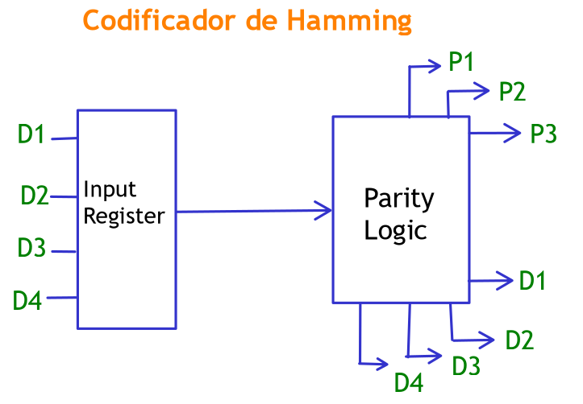
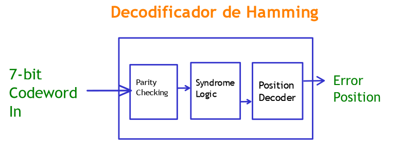

# Proyecto 1 - Diseño Lógico (EL-3307)

## 1. Descripción General

Este proyecto implementa un sistema digital en FPGA que detecta y corrige errores de un solo bit utilizando el código de Hamming (7,4). Fue desarrollado utilizando SystemVerilog y probado en una FPGA TangNano, simulando la transmisión de una palabra binaria y la corrección de errores intencionales en la recepción.

## 2. Subsistemas del diseño

- **Codificador**: Genera la palabra de 7 bits con bits de paridad a partir de los 4 bits de entrada.
- **Decodificador**: Detecta errores y calcula el síndrome usando los bits de paridad.
- **Corrector**: Corrige la palabra en caso de error.
- **LED Display**: Muestra la palabra corregida en binario.
- **7 Segment Display**: Muestra la palabra o la posición del error según un switch de control.
- **Módulo principal**: Integra todos los subsistemas anteriores.

## 3. Diagrama de bloques

### Codificador de Hamming

Este subsistema toma una palabra de **4 bits de entrada (datos)** y genera una palabra de **7 bits de salida**, agregando **3 bits de paridad** que permiten la detección y corrección de errores de un solo bit.  
La lógica interna utiliza **compuertas XOR** para calcular los bits de paridad según el algoritmo de Hamming (7,4).

La distribución típica de bits es:  
**[P1, P2, D1, P3, D2, D3, D4]**, donde P1–P3 son los bits de paridad, y D1–D4 los datos originales.

Este bloque asegura que toda palabra transmitida tenga redundancia suficiente para detectar y corregir un error.

### Decodificador y Verificador de Paridad

Este subsistema recibe una palabra codificada de **7 bits** que puede contener un error de transmisión.  
Internamente, recalcula los **bits de paridad esperados** y los compara con los bits recibidos, generando así un **síndrome de 3 bits**.

Este síndrome indica la posición exacta (de 1 a 7) del bit erróneo, si existe.  
La lógica incluye:
- **Verificador de paridad** (XOR)
- **Generador de síndrome**
- **Decodificador de posición**

Este módulo no corrige el error, solo lo detecta y localiza.

### Corrector de Error

El corrector toma como entradas:
- La palabra de 7 bits recibida
- El **síndrome** generado por el decodificador

Si el síndrome es distinto de cero, significa que hay un error en la posición indicada.  
Este módulo **corrige el error invirtiendo ese bit** mediante una operación XOR localizada.

La salida es una palabra corregida de 7 bits, de la cual se extraen los **4 bits originales de datos**.

Este bloque asegura que la información recuperada sea fiel a la enviada.

El resultado final es una palabra **de 4 bits corregida**, lista para ser mostrada por los subsistemas de salida.

### Despliegue Binario en LEDs

Este subsistema muestra la **palabra corregida** de 4 bits directamente en los LEDs de la FPGA.  
Cada bit de la palabra encendida activa su LED correspondiente, permitiendo observar el valor binario completo de la salida.

Esto permite una visualización inmediata y en binario del resultado corregido, útil para verificar la salida manualmente durante pruebas.

### Despliegue en Display de 7 Segmentos

Este subsistema permite mostrar en un display de 7 segmentos:
- La **palabra corregida** (en formato hexadecimal), o  
- El **síndrome de error** (posición del bit con error)

La selección de qué información mostrar se realiza mediante un **switch selector**.  
Internamente, se utiliza un **MUX** que escoge entre la palabra corregida y el síndrome, y luego un codificador traduce ese valor a su equivalente en 7 segmentos (segmentos A–G).

### Módulo Principal (Top Module)

Este subsistema se encarga de **interconectar todos los módulos anteriores**, gestionando el flujo de datos desde la entrada hasta las salidas.  
Recibe las palabras ingresadas por los switches, las pasa por el **codificador**, luego por el **decodificador y corrector**, y finalmente envía la salida a los **displays**.

El **selector de modo** determina si el display de 7 segmentos muestra la palabra corregida o el síndrome.  
Este módulo representa el comportamiento del sistema completo y centraliza su operación.
Es el único módulo que gestiona el flujo de datos **de extremo a extremo**, desde switches de entrada hasta la visualización final.

## 4. Simulaciones

*(Aquí se incluirán capturas y análisis del comportamiento esperado de entrada/salida)*

## 5. Análisis de recursos

*(Aquí se incluirá el uso de LUTs, FFs, potencia si usaste herramientas de síntesis)*

## 6. Problemas encontrados y soluciones

- Conexiones incorrectas en el display de 7 segmentos → resuelto revisando configuración de pines.
- Error en bits de paridad → corregido tras verificar ecuaciones del síndrome.
